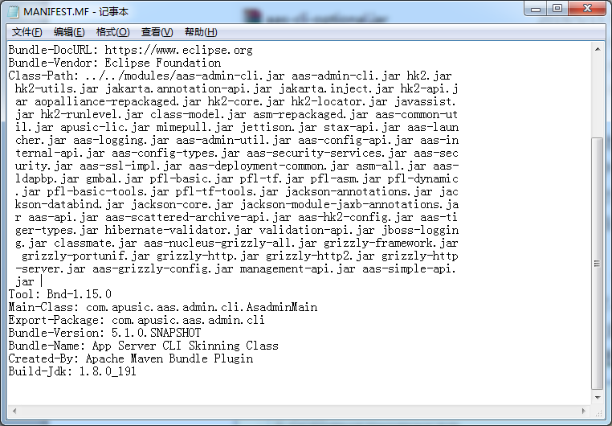
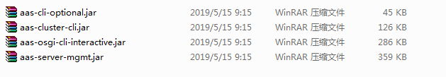
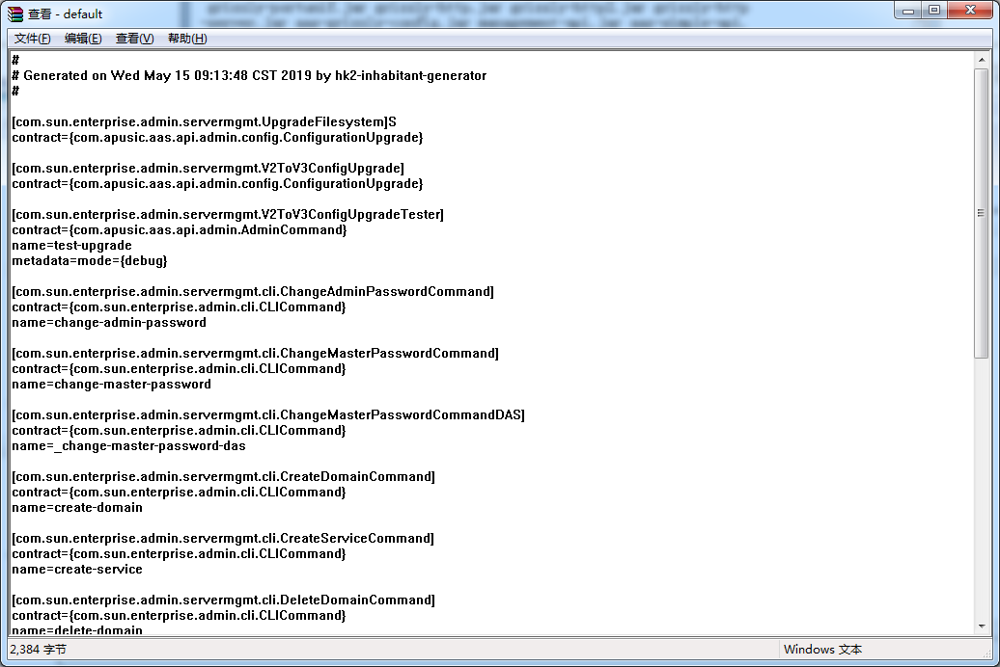
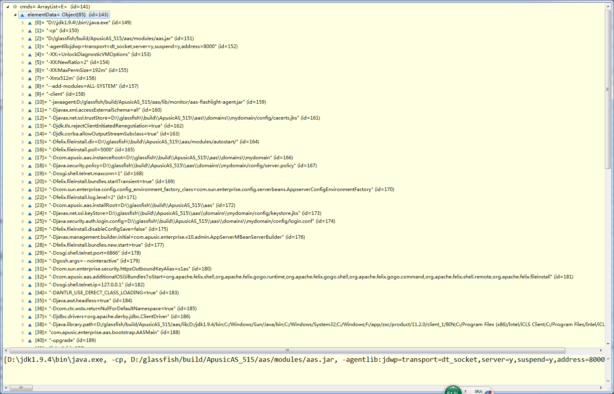
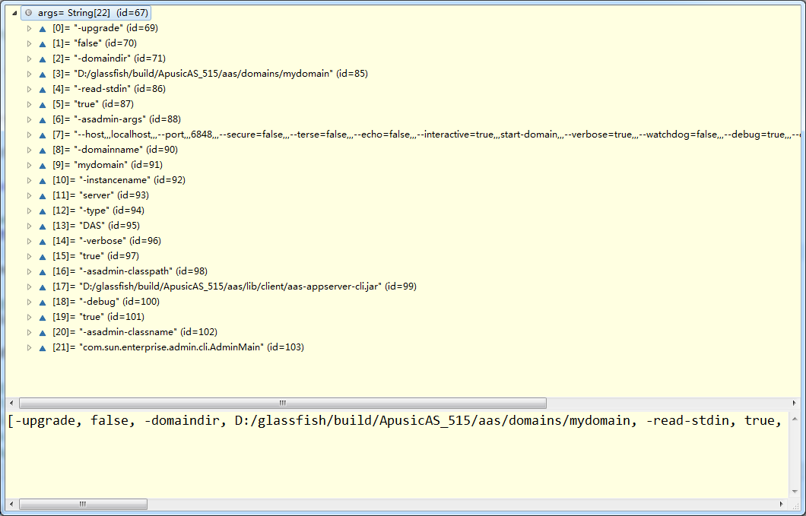
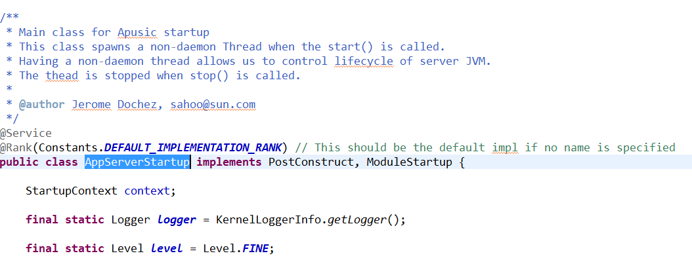
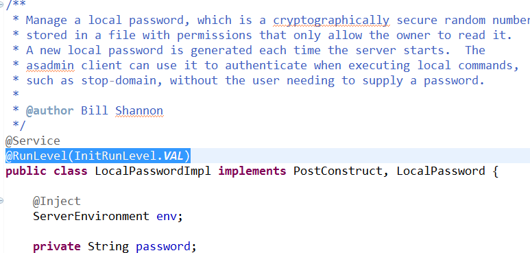

## 1.  收集Command接口

   Asadmin命令启动的时候是启动/lib/client/aas-appserver-cli.jar的com.apusic.aas.admin.cli.AsadminMain类,这个jar包只有一个启动类。这个jar包需要依赖的jar都在manifest文件的class-path中指定了：

 

main函数启动的时候会去寻找aas提供的命令实现类，这些命令类位于lib/asadmin目录下：

 

以及modules下的aas-admin-cli.jar。

启动的时候会去读这些jar包中的META-INFO/hk2-locator/default文件，这些文件中描述了每个命令的实现类：

 
这些文件内容读取出来以后都会存储在hk2模块（Hk2是一个依赖注入的框架）中，这些类的实例也是由hk2模块负责创建的。找命令的时候，是先去找本地的命令，即上面那些jar包中的命令，找不到则返回一个远程命令。

每一个命令都是CLICommand接口的实现，读取META-INFO/hk2-locator/default文件时，里面的命令都会注册成一个该接口的实例，不同的实例用name属性进行区分。查找的时候通过CLICommand接口和name进行查找。

## 2. start-domain子命令

执行start-domain子命令的时候要去解析domain.xml，解析后拼接成进程启动命令，该命令的参数如下：

 

可以看到启动的classpath是modules/aas.jar，启动类是AASMain。

如果使用---verbose参数启动start-domain，则启动后asadmin进程并不会退出，而是等到aas进程停止后才会退出

Asadmin start-domain会启动一个新进程，新进程接收到的启动参数如下：

启动的时候首先会创建一个classloader，该classloader的ucp包括aas.jar，aas-simple-api.jar以及osgi/felix/bin/felix.jar，接下来的类都是通过这个classloader来加载的。


## 3. 构建ApusicRuntime：
用ServiceLoader机制从aas.jar/services中找到OSGiApusicRuntimeBuilder类，然后调用这个类的build方法进行构建。执行build的时候，会启动osgi框架，如果没设置"aas.osgi.ondemand"，则使用BundleProvisioner(否则使用 MinimalBundleProvisioner)安装bundle（第一次启动的时候），并start bundle。aas大部分bundle在启动的时候并不会执行什么代码逻辑，（[AAS 所有的Activator](./AASV10_Activator.md)）除了以下几个（当然不只这几个）：

-   aas.jar: ApusicMainActivator向osgi注册了com.apusic.aas.embeddable.ApusicRuntime服务，实现类为com.apusic.enterprise.aas.bootstrap.osgi.EmbeddedOSGiApusicRuntime
-   osgi-adapter.jar：
    -   HK2Main创建ModuleRegistry实例，ModuleRegistry在hk2中很重要，所有的类查找都是委托给它的。这里创建的这个实例是和osgi强耦合的，构造的时候会将osgi的bundles作为模块加入进来（与之对应的是asadmin程序启动的时候创建的ModuleRegistry是StaticModuleRegistry，该ModuleRegistry将所有的jar作为一个模块）。并将ModuleRegistry注册成为osgi的服务；
    -   HK2Main创建ServiceLocator实例，调用ModuleRegistry.populateConfig()方法，注入domain.xml 的配置
    -   注册com.sun.enterprise.module.bootstrap.Main服务,实现类为org.jvnet.hk2.osgiadapter.HK2Main

 构建的ApusicRuntime就是aas.jar中注册到OSGi的ApusicRuntime实例。


## 4. 构建Apusic实例：
利用ApusicRuntime.newApusic()方法创建Apusic实例，由于ApusicRuntime是EmbeddedOSGiApusicRuntime，而这个类是由OSGi的bundle classloader加载的，所以newApusic()方法是在OSGi的容器中运行的（即所需要用到的类都通过BundleClassLoader来加载）。构建Apusic实例的步骤包括：
a.  获取osgi-adapter.jar中注册的Main服务;    
b.  利用main服务创建hk2的ServiceLocator对象，创建这个对象需要的ModuleRegistry对象从osgi中获取。创建的ServiceLocator注册成为osgi服务；    
c.  利用ServiceLocator找到ModuleStartup接口实现类实例：AppServerStartup
 这个类利用了hk2的@service注解声明了一个hk2服务。
d.  创建ApusicImpl实例及其包装器对象，传入AppServerStartup实例，返回。

## 5.  调用Apuisc实例的start方法:
由于Apusic实例是由EmbeddedOSGiApusicRuntime创建的，所以start方法也处于OSGi容器环境中, start方法主要逻辑都是委托给AppServerStartup的start方法：

a.  先设置Thread的contextClassLoader为CommonClassloader，该classloader负责加载所有应用公共的class，包括以下路径的类：lib/\*.jar:domain\_dir/lib/classes:domain\_dir/lib/\*.jar:DERBY\_DRIVERS，该classloader的代理classloader是APIClassloader，该classloader负责加载暴露给外部的类，包括javaee API等

b.  Hk2的服务声明的时候可以指定启动级别：

 

 级别越低，越先启动。系统的初始级别为-2，当系统的级别往上提升的时候，对应级别的服务会接着启动。服务启动的时候会实例化，然后调用postConstruct方法。例如：将系统的启动级别提升到1时，会先启动级别为-1的服务，再启动级别为0的服务，再启动级别为1的服务。启动的时候默认是多线程启动的,也就是说同一个级别的服务是多线程启动。

c.  调用RunLevelControllerImpl的processTo(int runLevel)方法将系统启动级别设置为1。这会导致启动级别为-1,0,1的服务会相继启动。-1和0的服务几乎没有.

启动级别为0的服务有:
```java
com.apusic.aas.internal.api.Globals.GlobalsInitializer
```
启动级别为1的服务有以下8个：

```java
 com.apusic.enterprise.server.logging.LogManagerService
 com.apusic.enterprise.naming.ApusicNamingBuilder
 com.apusic.enterprise.v10.admin.LocalPasswordImp
 com.apusic.enterprise.v10.admin.listener.CombinedJavaConfigSystemPropertyListener
 com.apusic.enterprise.v10.server.SystemTasksImpl
 org.apache.naming.resources.WebNamingStartup
 com.apusic.aas.kernel.javaee.MEJBService
 com.apusic.aas.admin.monitor.MonitoringBootstrap
```
d.  将启动级别设置为10，包含的服务如下：

 级别为2的服务：
 ```java
 com.apusic.aas.resourcebase.resources.listener.ResourceManager
 ```
 启动级别为10的服务有19个：
```java
 com.apusic.enterprise.v10.services.impl.GrizzlyService
 com.apusic.aas.enterprise.api.enabler.ORBConnectorStartup
 com.apusic.aas.ha.store.adapter.cache.ReplicationStoreProxy2
 com.apusic.aas.ha.store.adapter.cache.ShoalBackingStoreProxy
 com.apusic.enterprise.v10.admin.JobCleanUpService
 com.apusic.enterprise.v10.admin.MbeanService
 com.apusic.enterprise.v10.server.ApplicationLoaderService
 com.apusic.enterprise.v10.server.FighterFishStartupService
 com.apusic.enterprise.v10.server.LifecycleModuleService
 com.apusic.aas.admin.rest.adapter.JerseyContainerCommandService
 com.sun.enterprise.security.jmac.MessageSecurityConfigEventListenerImpl
 com.apusic.aas.gms.bootstrap.GMSAdapterService
 com.apusic.aas.config.support.ConfigConfigBeanListener
 com.sun.enterprise.transaction.startup.TransactionLifecycleService
 com.apusic.aas.batch.spi.impl.BatchRuntimeHelper
 com.apusic.aas.kernel.javaee.WebContainerStarter
 com.sun.enterprise.security.admin.cli.SecureAdminStartupCheck
 com.sun.enterprise.admin.util.CommandThreadPool
 com.sun.enterprise.admin.util.InstanceStateServiceImpl
```

e.  将启动级别设置为20，包含的服务如下：
```java
com.apusic.aas.admin.monitor.jvm.JVMStatsProviderBootstrap
com.apusic.aas.admin.mbeanserver.MBeanServerFactory
com.apusic.aas.admin.mbeanserver.JMXStartupService
com.apusic.aas.deployment.autodeploy.AutoDeployService
com.apusic.aas.internal.config.UnprocessedConfigListener
com.apusic.aas.resources.listener.ApplicationScopedResourcesManager
com.apusic.enterprise.v10.admin.adapter.AdminConsoleStartupService
com.apusic.enterprise.v10.server.ApplicationConfigListener
com.apusic.enterprise.v10.server.DomainXmlPersistence
com.apusic.enterprise.v10.server.DynamicReloadService
com.sun.enterprise.security.admin.cli.SecureAdminConfigMonitor
com.sun.enterprise.connectors.jms.system.JmsProviderLifecycle
com.sun.enterprise.container.common.impl.managedbean.ManagedBeanManagerImpl
```

4.  接下来就是看上面这些服务启动的时候都干啥了,未完待续...

