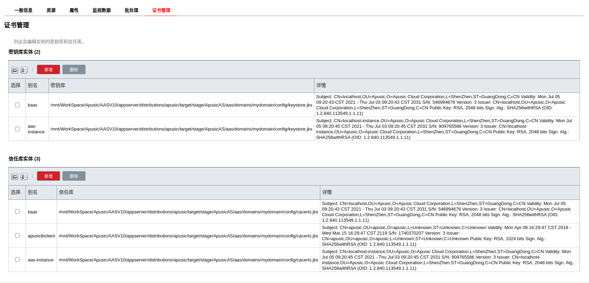
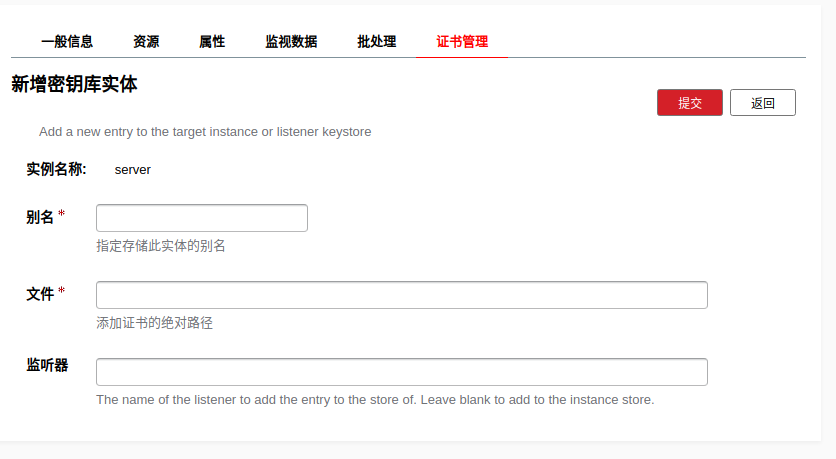
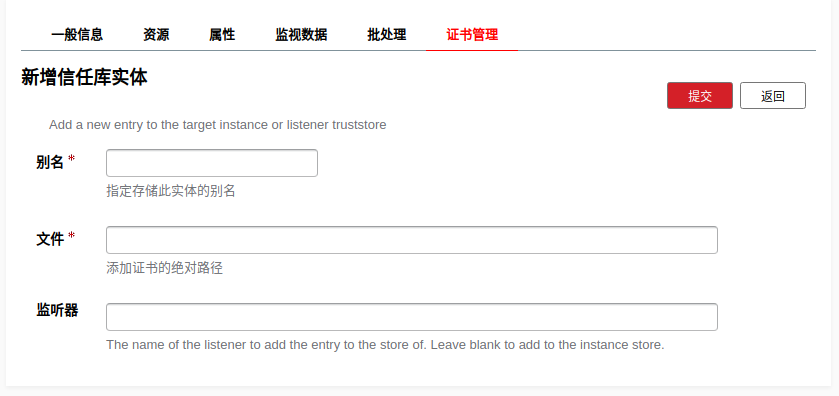

### 证书管理系统
#### 1 基本概念

- 证书：公钥的载体，除了公钥外，里面还包括该证书的持有人的信息，例如姓名，地址…等。文件形式的证书后缀通常为 crt 或 cert。
- 证书库：保存证书的存储库,通常的证书库格式有 JKS（只在 java 程序中使用）和 pfx(或 p12)，证书库中除了包含证书外，还可以包含私钥。在 SSL配置中，有时（双向认证时）除了配置证书库外，还需要配置信任证书库，信任证书库是用于保存信任的第三方证书用的。
- 证书请求文件：当向 CA 申请证书时，有时 CA 会要求提供证书请求文件（csr 文件），该文件中包含申请者的个人信息，可以通过记事本等工具打开。
- 单向认证/双向认证：前者用于客户端认证服务器，即客户端认证服务器端传过来的证书；后者除了 客户端需要认证服务器的证书外，服务器端也需要认证客户端的证书。直接信任该证书或信任该证书的 颁发者证书都可以完成对该证书的认证。

#### 2 证书管理
证书管理系统是用于管理证书的模块。进入AAS V10 的管理控制台后，选择服务器（管理服务器）后，然后再选择证书管理标签。

在此界面中，管理员可以添加和删除密钥库中的证书。

##### 添加密钥库实体

添加一个密钥或者证书到目标实例中或者监听器（listener）的密钥库。

- 别名： 新增的证书在密钥库的别名。
- 文件： 私钥和/或证书文件在服务器的绝对路径，支持.cert或者.pem格式。
- 监听器：添加密钥库到指定监听器中。

##### 添加信任库实体

添加一个证书到目标实例中或者监听器（listener）信任库库。

- 别名： 新增的证书在信任库的别名。
- 文件： 私钥和/或证书文件在服务器的绝对路径，支持.cert或者.pem格式。
- 监听器：添加证书到指定监听器中。

